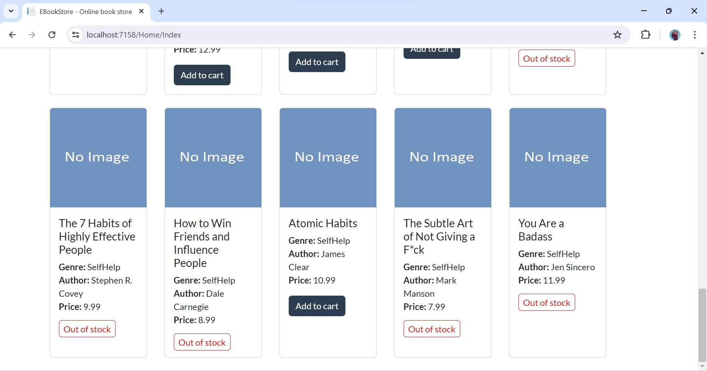
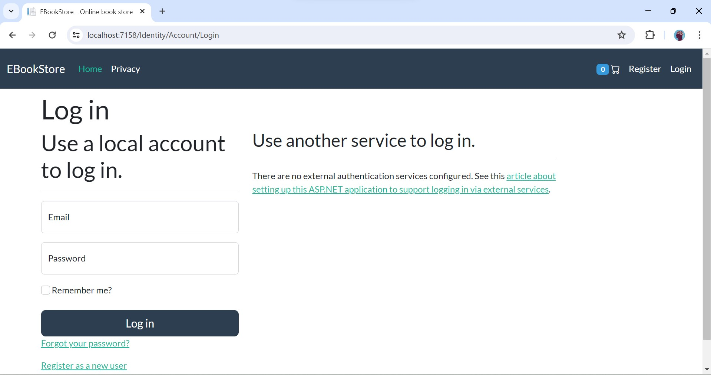
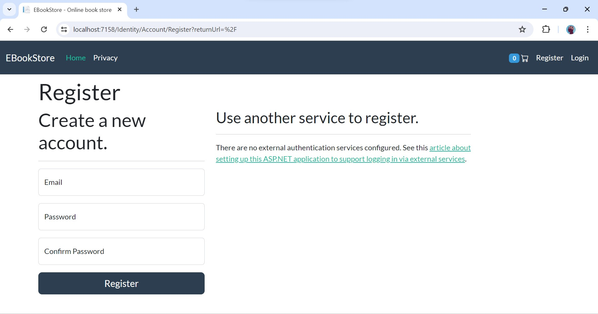
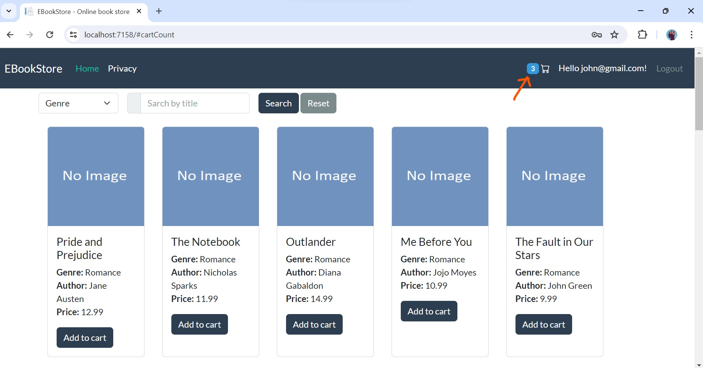
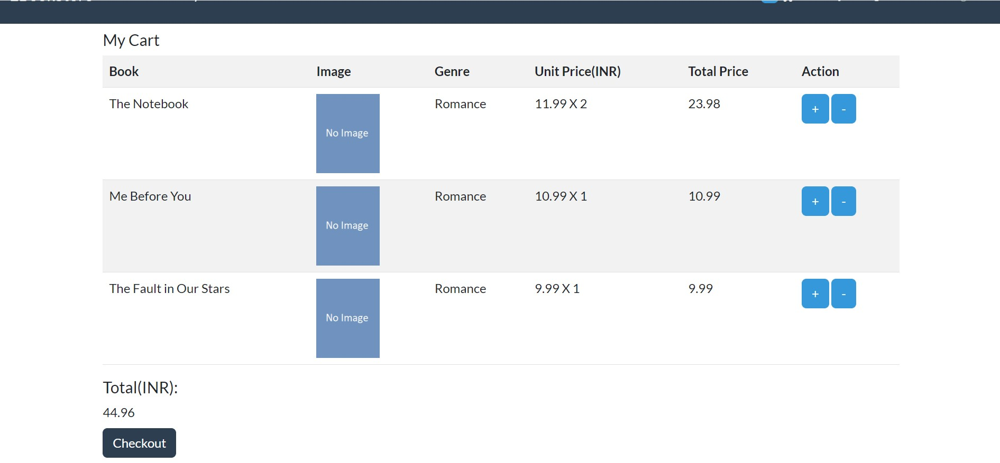
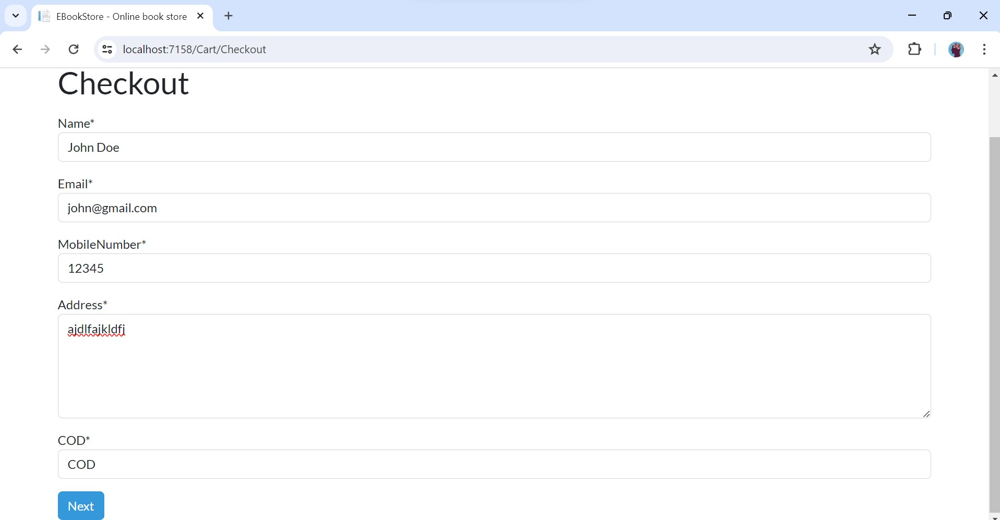
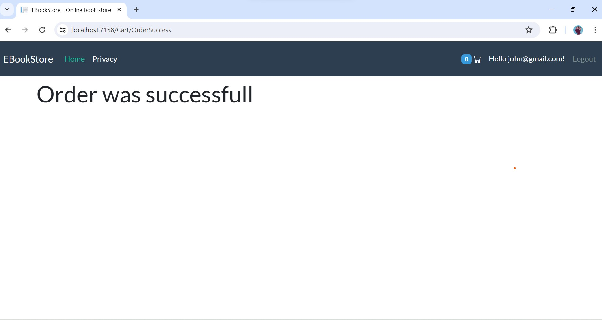
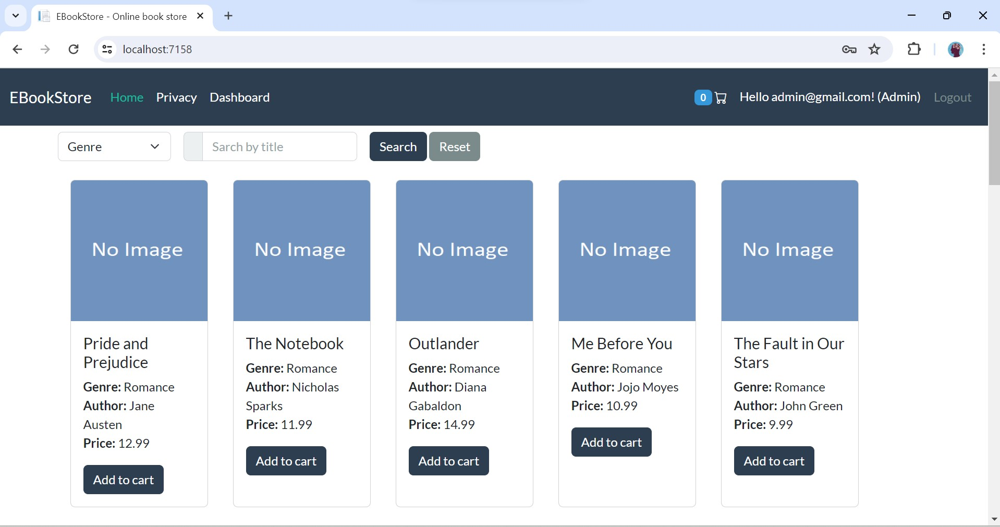

# BookShoppingCartMvc (A basic e-comm system for beginners)📚🛒

It is a source code of the youtube tutorial on [Build a Full E-commerce Application Using .NET Core 10, SQL Server 2025, MVC | Complete Tutorial](https://youtu.be/_NzPJSofid8?si=jHuiACNd3dxzT1Go). Initially it was designed to explain how shopping cart 🛒 works in dot net core mvc. But now it has more features except payment gateway. A ⭐ in repository is highly appreciated, helps to promote my content.

📢 Initially , this project was built with `.net 7` and `sql server 2022`. But it is `Upgraded to .net 10.0` and `sql server 2025` and I will try to keep it up to date.

## Tech stack 🧑‍💻

   - Dotnet core mvc (.Net 10.0)
   - MS SQLServer 2025 (Database)
   - Entity Framework Core (ORM)
   - Identity Core (Authentication)
   - Bootstrap 5 (frontend)

## Tools I have used and their alternative (Updated versions)

- Visual Studio 2026 (Alternatives : .NET SDK + VS Code or .NET SDK + JetBrains Rider).
- Microsoft Sql Server Management Studio (Alternative : mssql extension for vscode / dbeaver).
- Instead of manually installing `sql server`, you can also used `sql server` which is spun up in `docker`.

**Note:** Every tool and tech is free for personal use. 

## Video tutorial 📺

[Build a Full E-commerce Application Using .NET Core 10, SQL Server, MVC | Complete Tutorial](https://youtu.be/_NzPJSofid8?si=jHuiACNd3dxzT1Go)

## How to run the project?🌐

### 1. With docker compse (Quickest way)

It is the quickest way to run the application. You don't need to install anything on your system, except docker. Make sure you have installed `Docker` in your machine. Now, run the following command

```bash
docker compose up -d
```

- Your application will be served at `http://localhost:8080/`.
- Admin's `username` and `password` is given below (How to logged-in with admin account??🧑‍💻🧑‍💻).

**Note:** If you want to debug application and want to modify the project, I would recommend to follow the second approach.

### 2. Manually setup every thing (Recommended for developers)

Make sure:
- Either Dotnet sdk 10.0 or VisualStudio 2026 pre-installed in your machine
- pre-installed Sql server 2025 or spun up it in docker container

Now, you can follow these steps:

1. Open the command prompt. Go to a directory where you want to clone this project. Use this command to clone the project.

```bash
git clone https://github.com/rd003/BookShoppingCart-Mvc
```

2. Go to the directory where you have cloned this project, open the directory `BookShoppingCart-Mvc`. You will find a file with name `BookShoppingCartMvc.sln`. Double click on this file and this project will be opened in Visual Studio.

3. Open `appsettings.json` file and update connection string.

```json
"ConnectionStrings": {
  "conn": "data source=your_server_name;initial catalog=MovieStoreMvc; integrated security=true;encrypt=false"
}
```

**Note:** It is not mandatory to install `sql server 2025` in your machine. You can spin up the `sql server` in docker container and use that for this application. But in this case your connection string will be different `Server=localhost,1433;Database=BookShoppingCartMvc;User Id=sa;Password=your_password;TrustServerCertificate=True`.

4. Run the project.

📢 When you run the project for the first time, it will do following things:

- It will generate the database
- It will seed some data
- It will create an account for `admin`

## How to logged-in with admin account?? 🧑‍💻🧑‍💻

Click on the link named `login` and get logged-in with these credentials.

```text
username: admin@gmail.com

password: Admin@123
```

## Screenshots

1.Homepage


2.Homepage continued



3.Login



4.Registration



5.Add To Cart



6.Cart



7.Checkout



8.Order success



9.Admin Login



10.Admin Dashboard


11.Orders


12.Order Detail


13.Update Order Status


14.Display Stock


15.Update Stock


16.Display Genre


17.Add Genre


18.Update Genre


19.Display Books


20.Add Book


21.Update Book


22.Top Selling Books


## Thanks

If you find this repository useful, then consider to leave a ⭐.

Connect with me

👉 YouTube: <https://youtube.com/@ravindradevrani>

👉 Twitter: <https://twitter.com/ravi_devrani>

Become a supporter ❣️:
You can buy me a coffee 🍵 : <https://www.buymeacoffee.com/ravindradevrani>

Thanks a lot 🙂🙂
